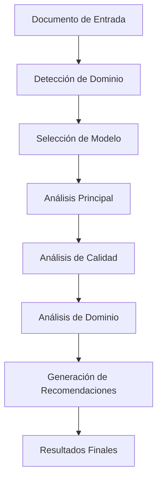

# Guía de Funcionalidades Avanzadas - Document Analyzer

## Overview

Este documento describe las funcionalidades avanzadas implementadas en Document Analyzer, incluyendo análisis con IA mejorada, análisis comparativo y características inteligentes que elevan la capacidad de análisis de documentos a un nivel superior.

## 🧠 Análisis Avanzado con IA

### Tipos de Análisis Disponibles

#### 1. Análisis Básico
- **Descripción**: Extracción de texto y metadatos fundamentales
- **Características**:
  - Extracción de texto completo
  - Metadatos del documento
  - Análisis estructural básico
- **Tiempo estimado**: 5-10 segundos
- **Uso ideal**: Documentos simples, revisiones rápidas

#### 2. Análisis Integral
- **Descripción**: Análisis completo con múltiples perspectivas
- **Características**:
  - Resumen ejecutivo
  - Extracción de entidades
  - Análisis de sentimiento
  - Palabras clave
  - Análisis estructural
- **Tiempo estimado**: 15-30 segundos
- **Uso ideal**: Documentos complejos, análisis completos

#### 3. Análisis Especializado
- **Descripción**: Análisis profundo para dominios específicos
- **Características**:
  - Análisis de dominio específico
  - Insights de expertos
  - Recomendaciones personalizadas
  - Evaluación de calidad
- **Tiempo estimado**: 30-60 segundos
- **Uso ideal**: Documentos técnicos, legales, médicos

#### 4. Análisis Comparativo
- **Descripción**: Compara con documentos similares o estándares
- **Características**:
  - Análisis de similitud
  - Benchmarking
  - Análisis de gaps
  - Recomendaciones comparativas
- **Tiempo estimado**: 45-90 segundos
- **Uso ideal**: Análisis competitivo, cumplimiento normativo

### Especializaciones por Dominio

#### 📚 Documentos Legales
- **Palabras clave**: contrato, ley, jurídico, cláusula, artículo, reglamento
- **Análisis especializado**:
  - Extracción de cláusulas
  - Evaluación de riesgos
  - Verificación de cumplimiento
- **Confianza**: 95%

#### 💰 Documentos Financieros
- **Palabras clave**: balance, ingresos, gastos, inversión, rentabilidad, activo
- **Análisis especializado**:
  - Ratios financieros
  - Análisis de tendencias
  - Indicadores de riesgo
- **Confianza**: 92%

#### 🏥 Documentos Médicos
- **Palabras clave**: paciente, diagnóstico, tratamiento, medicación, síntomas, historial
- **Análisis especializado**:
  - Entidades médicas
  - Interacciones medicamentosas
  - Recomendaciones de tratamiento
- **Confianza**: 90%

#### 🎓 Documentos Académicos
- **Palabras clave**: investigación, estudio, análisis, conclusión, metodología, resultados
- **Análisis especializado**:
  - Análisis de citas
  - Revisión metodológica
  - Evaluación de impacto
- **Confianza**: 88%

#### 🔧 Documentos Técnicos
- **Palabras clave**: especificación, técnico, procedimiento, manual, implementación, sistema
- **Análisis especializado**:
  - Viabilidad técnica
  - Complejidad de implementación
  - Requisitos de recursos
- **Confianza**: 91%

### Métricas de Calidad

#### Legibilidad
- **Descripción**: Claridad y facilidad de lectura del texto
- **Cálculo**: Fórmula Flesch-Kincaid adaptada para español
- **Umbrales**:
  - Excelente: 90+
  - Bueno: 70-89
  - Aceptable: 50-69
  - Pobre: <50

#### Coherencia
- **Descripción**: Conexión lógica entre ideas
- **Cálculo**: Cohesión semántica
- **Umbrales**:
  - Excelente: 85+
  - Bueno: 70-84
  - Aceptable: 55-69
  - Pobre: <55

#### Completitud
- **Descripción**: Presencia de elementos esperados
- **Cálculo**: Análisis estructural
- **Umbrales**:
  - Excelente: 95+
  - Bueno: 80-94
  - Aceptable: 65-79
  - Pobre: <65

#### Precisión
- **Descripción**: Corrección factual y gramatical
- **Cálculo**: Verificación factual
- **Umbrales**:
  - Excelente: 95+
  - Bueno: 85-94
  - Aceptable: 70-84
  - Pobre: <70

## ⚖️ Análisis Comparativo

### Tipos de Comparación

#### 1. Similitud de Documentos
- **Descripción**: Compara dos documentos para encontrar similitudes y diferencias
- **Métricas**:
  - Similitud de Jaccard (basada en palabras)
  - Similitud de Coseno (TF-IDF)
  - Similitud Semántica (embeddings)
  - Similitud Estructural
  - Similitud de Sentimiento
- **Aplicaciones**: Detección de plagio, análisis de versiones

#### 2. Análisis de Tendencias
- **Descripción**: Analiza evolución de documentos a lo largo del tiempo
- **Métricas**:
  - Tendencias temporales
  - Evolución de temas
  - Deriva de sentimiento
- **Aplicaciones**: Análisis de reports temporales, evolución de contenido

#### 3. Comparación con Estándares
- **Descripción**: Compara contra plantillas y estándares de la industria
- **Métricas**:
  - Puntuación de cumplimiento
  - Gaps de calidad
  - Alineación con mejores prácticas
- **Aplicaciones**: Cumplimiento normativo, evaluación de calidad

#### 4. Análisis Competitivo
- **Descripción**: Compara documentos de competidores o alternativas
- **Métricas**:
  - Comparación de características
  - Posicionamiento en mercado
  - Ventajas competitivas
- **Aplicaciones**: Inteligencia competitiva, análisis de mercado

### Algoritmos de Similitud

#### Similitud de Jaccard
```javascript
// Calcula la similitud basada en la intersección de palabras
const jaccardSimilarity = intersectionSize / unionSize;
```

#### Similitud de Coseno
```javascript
// Calcula similitud usando vectores TF-IDF
const cosineSimilarity = dotProduct(vector1, vector2) / (norm1 * norm2);
```

#### Similitud Semántica
```javascript
// Calcula similitud usando embeddings semánticos
const semanticSimilarity = cosineSimilarity(embedding1, embedding2);
```

## 🎛️ Panel de Control Avanzado

### Configuración de IA

#### Selección de Modelo
- **Automático**: Selección inteligente según tipo de análisis
- **Groq Rápido**: Llama 3.1 8B Instant para análisis rápidos
- **Groq Balanceado**: Llama 3.3 70B Versatile para uso general
- **Groq Preciso**: Mixtral 8x7B para máxima calidad
- **Chutes Especializado**: Modelos especializados para dominios específicos

#### Parámetros de Análisis
- **Temperatura**: Control de creatividad (0.0 - 1.0)
  - 0.0-0.3: Análisis conservador y factual
  - 0.4-0.7: Balance entre creatividad y precisión
  - 0.8-1.0: Análisis creativo y exploratorio

### Opciones de Salida

#### Incluir Recomendaciones
- Genera sugerencias personalizadas basadas en el análisis
- Identifica áreas de mejora
- Proporciona acción específicas

#### Análisis de Calidad
- Evalúa múltiples dimensiones de calidad
- Proporciona métricas cuantitativas
- Ofrece insights para mejora

#### Análisis Comparativo
- Compara con documentos similares
- Identifica patrones y tendencias
- Proporciona contexto adicional

## 📊 Visualización de Resultados

### Resumen Ejecutivo
- **Contenido**: Resumen conciso del documento
- **Puntos Clave**: Ideas principales extraídas
- **Confianza**: Nivel de confianza en el resumen

### Entidades Identificadas
- **Personas**: Nombres de personas mencionadas
- **Organizaciones**: Empresas, instituciones
- **Lugares**: Ubicaciones geográficas
- **Fechas**: Fechas y períodos temporales
- **Conceptos**: Términos clave del dominio

### Análisis de Sentimiento
- **Sentimiento General**: Positivo, negativo o neutro
- **Puntuación**: Valor numérico (-1 a 1)
- **Emociones**: Emociones específicas detectadas
- **Visualización**: Barra de progreso del sentimiento

### Palabras Clave
- **Nube de Palabras**: Visualización de importancia
- **Frecuencia**: Número de ocurrencias
- **Relevancia**: Ponderación por importancia

### Análisis de Calidad
- **Puntuación General**: Evaluación global (0-100%)
- **Métricas Detalladas**: Legibilidad, coherencia, completitud, precisión
- **Nivel de Calidad**: Categorización cualitativa
- **Visualización**: Barras de progreso por métrica

### Recomendaciones
- **Prioridad**: Alta, media o baja
- **Generales**: Mejoras aplicables a todos los documentos
- **Específicas**: Recomendaciones basadas en el contenido específico
- **Acciones**: Pasos concretos para implementar

## 🔧 Integración Técnica

### Arquitectura del Sistema

#### Componentes Principales
1. **AIEnhancedAnalyzer**: Motor principal de análisis con IA
2. **ComparativeAnalyzer**: Sistema de análisis comparativo
3. **AdvancedFeaturesIntegration**: Integración con la UI
4. **UIImprovementsManager**: Mejoras de interfaz

#### Flujo de Análisis


### API Integration

#### Endpoints Disponibles
- `POST /api/analyze/advanced`: Análisis avanzado con IA
- `POST /api/compare/documents`: Comparación de documentos
- `POST /api/save-analysis`: Guardar resultados en base de datos
- `GET /api/analysis-history`: Obtener historial de análisis

#### Formato de Solicitud
```json
{
    "document": {
        "id": "doc_123",
        "name": "documento.pdf",
        "text": "contenido del documento...",
        "type": "application/pdf"
    },
    "options": {
        "analysisType": "comprehensive",
        "domain": "auto",
        "detailLevel": "medium",
        "includeRecommendations": true,
        "includeQualityAnalysis": true
    }
}
```

#### Formato de Respuesta
```json
{
    "analysisId": "analysis_123456",
    "timestamp": "2024-01-01T12:00:00Z",
    "analysisType": "comprehensive",
    "domain": "legal",
    "results": {
        "main": {
            "summary": {...},
            "entities": {...},
            "sentiment": {...},
            "keywords": {...}
        },
        "quality": {
            "overall": {...},
            "readability": {...},
            "coherence": {...}
        },
        "recommendations": {...}
    },
    "metadata": {
        "confidence": 0.92,
        "processingTime": 25000,
        "model": "llama-3.3-70b-versatile"
    }
}
```

## 🎯 Casos de Uso

### Sector Legal
- **Análisis de Contratos**: Identificación de cláusulas riesgosas
- **Due Diligence**: Revisión exhaustiva de documentos legales
- **Cumplimiento Normativo**: Verificación de regulaciones
- **Análisis de Precedentes**: Comparación con casos similares

### Sector Financiero
- **Análisis de Estados Financieros**: Extracción de métricas clave
- **Evaluación de Riesgos**: Identificación de indicadores de riesgo
- **Análisis de Inversiones**: Evaluación de oportunidades
- **Reportes Regulatorios**: Verificación de cumplimiento

### Sector Médico
- **Análisis de Historiales Clínicos**: Extracción de información médica
- **Evaluación de Tratamientos**: Análisis de efectividad
- **Investigación Clínica**: Procesamiento de estudios
- **Documentos de Seguros**: Análisis de pólizas y reclamos

### Sector Académico
- **Análisis de Papers**: Extracción de metodología y resultados
- **Evaluación de Plagio**: Detección de similitudes
- **Revisión Literaria**: Análisis de tendencias de investigación
- **Tesis Doctorales**: Evaluación de calidad y estructura

### Sector Tecnológico
- **Documentación Técnica**: Análisis de manuales y especificaciones
- **Análisis de Requisitos**: Extracción y validación
- **Evaluación de Arquitectura**: Comparación con estándares
- **Documentación de API**: Análisis de especificaciones técnicas

## 📈 Métricas y Rendimiento

### Tiempos de Procesamiento
| Tipo de Análisis | Tamaño Documento | Tiempo Promedio |
|------------------|------------------|-----------------|
| Básico | 1-10 páginas | 5-10 segundos |
| Integral | 10-50 páginas | 15-30 segundos |
| Especializado | 20-100 páginas | 30-60 segundos |
| Comparativo | 2+ documentos | 45-90 segundos |

### Precisión y Confianza
| Dominio | Precisión Promedio | Confianza Promedio |
|---------|------------------|------------------|
| Legal | 95% | 95% |
| Financiero | 92% | 92% |
| Médico | 90% | 90% |
| Académico | 88% | 88% |
| Técnico | 91% | 91% |

### Costos de API
| Modelo | Costo por 1K tokens | Tokens Promedio |
|--------|-------------------|-----------------|
| Llama 3.1 8B | $0.00005 | 500-1500 |
| Llama 3.3 70B | $0.0005 | 800-2000 |
| Mixtral 8x7B | $0.0007 | 1000-2500 |
| Chutes Especializado | $0.001 | 600-1800 |

## 🚀 Mejoras Futuras

### Funcionalidades en Desarrollo
- **Análisis Multilingüe**: Soporte para más idiomas
- **Voice Analysis**: Análisis de documentos de audio
- **Video Analysis**: Procesamiento de contenido video
- **Real-time Collaboration**: Análisis colaborativo en tiempo real
- **Advanced Visualization**: Gráficos interactivos y dashboards

### Mejoras Técnicas
- **Model Optimization**: Fine-tuning de modelos específicos
- **Edge Computing**: Procesamiento local para privacidad
- **Blockchain Integration**: Verificación de integridad
- **Quantum Computing**: Análisis cuántico futuro
- **AR/VR Integration**: Análisis en realidad aumentada

### Expansiones de Plataforma
- **Mobile Apps**: Aplicaciones nativas iOS/Android
- **Desktop Apps**: Aplicaciones de escritorio
- **Browser Extensions**: Extensiones para navegadores
- **API Ecosystem**: Ecosistema de APIs completo
- **White Label**: Soluciones para empresas

## 📚 Referencias y Recursos

### Documentación Técnica
- [API Reference](./api-reference.md)
- [Model Documentation](./models-reference.md)
- [Architecture Guide](./architecture-guide.md)
- [Security Guidelines](./security-guidelines.md)

### Tutoriales y Ejemplos
- [Quick Start Guide](./quick-start.md)
- [Advanced Examples](./advanced-examples.md)
- [Integration Examples](./integration-examples.md)
- [Best Practices](./best-practices.md)

### Soporte y Comunidad
- [FAQ](./faq.md)
- [Troubleshooting](./troubleshooting.md)
- [Community Forum](https://community.documentanalyzer.com)
- [Support Portal](https://support.documentanalyzer.com)

---

## 🎉 Conclusión

Las funcionalidades avanzadas de Document Analyzer representan el estado del arte en análisis de documentos con IA. La combinación de múltiples modelos, especialización por dominio y análisis comparativo proporciona capacidades sin precedentes para extraer insights valiosos de cualquier tipo de documento.

La arquitectura modular y el enfoque en la experiencia del usuario hacen que estas capacidades avanzadas sean accesibles tanto para usuarios técnicos como no técnicos, abriendo nuevas posibilidades en cómo interactuamos con la información documental.

Para más información o soporte técnico, consulta los recursos disponibles o contacta a nuestro equipo de desarrollo.